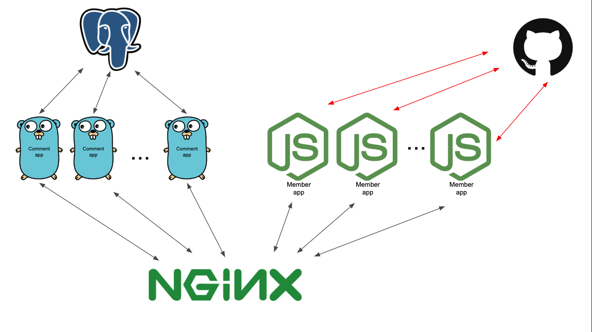

# git-comment

### Deployment Layout



_Black Arrows indicate internal service communication_

_Red Arrows indicate external service communication_

### Application Architecture


Useful link: [Uncle Bob's Clean Architecture](https://blog.cleancoder.com/uncle-bob/2012/08/13/the-clean-architecture.html)

### Getting Started

```bash
git clone git@github.com:stanleynguyen/git-comment.git
cd git-comment
cp comment-app/.env.sample comment-app/.env # fill in neccessary env variables
cp member-app/.env.sample member-app/.env # fill in neccessary env variables
make start_dev
```

### Testing

Applications have testing of required behaviors. There're some specific notes with regards to each of the application testing:

- **member-app**: This app doesn't depend on any internal service hence easily isolated and tested. It is as simple as `npm run test`
- **comment-app**: This app depends on an instance of PostgreSQL to be available. Hence, before tests can be run, it is required to set up a PostgreSQL instance and specify accordingly in `.env.test` to make the connection string available to test environment.
